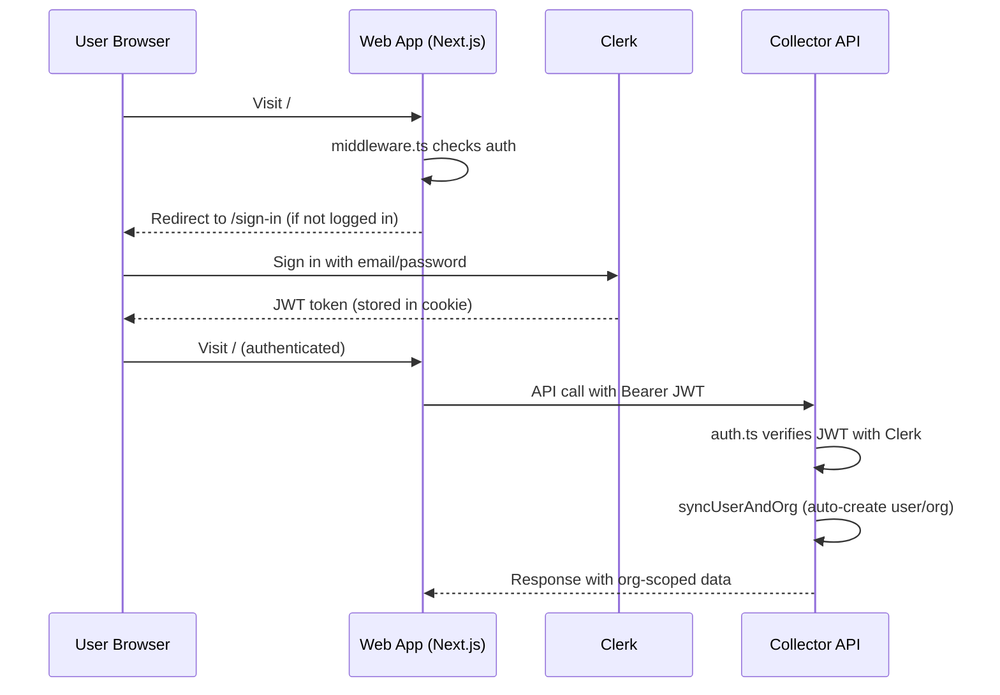

# PG Vitals — Clerk Auth Setup Guide (UAT)

> Your app already has Clerk fully wired up. You just need to create a Clerk project and set the API keys.

---

## 1. Create a Clerk Account & Project

1. Go to [clerk.com](https://clerk.com) and sign up (free tier is fine for UAT)
2. Click **"Create application"**
3. Name it: `PG Vitals UAT`
4. Under **Sign-in methods**, enable:
   - ✅ Email address
   - ✅ Password
   - (Optional) Google, GitHub OAuth
5. Click **Create**

---

## 2. Get Your API Keys

In the Clerk dashboard:

1. Go to **API Keys** (left sidebar)
2. Copy these two values:

| Key | Where to find | Example format |
|-----|--------------|----------------|
| **Publishable key** | Shown by default | `pk_test_abc123...` |
| **Secret key** | Click "Show" | `sk_test_xyz789...` |

---

## 3. Set Environment Variables

### Web App (Next.js)

Add to your `.env.local` or `.env` in `apps/web/`:

```bash
NEXT_PUBLIC_CLERK_PUBLISHABLE_KEY=pk_test_your_key_here
NEXT_PUBLIC_CLERK_SIGN_IN_URL=/sign-in
NEXT_PUBLIC_CLERK_SIGN_UP_URL=/sign-up
NEXT_PUBLIC_CLERK_AFTER_SIGN_IN_URL=/
NEXT_PUBLIC_CLERK_AFTER_SIGN_UP_URL=/
```

### Collector (Fastify API)

Add to your `.env` in `apps/collector/`:

```bash
CLERK_SECRET_KEY=sk_test_your_secret_key_here
```

> [!IMPORTANT]
> Both apps need the keys set. The web app uses the publishable key for the frontend UI. The collector uses the secret key to verify JWT tokens on API requests.

---

## 4. What's Already Wired Up

Your codebase has all the pieces in place — no code changes needed:

| Component | File | Status |
|-----------|------|--------|
| **Clerk Provider** | [`layout.tsx`](file:///Users/aungba/personal/pgvitals/apps/web/src/app/layout.tsx#L14-L19) | ✅ Wraps app when keys are set |
| **Sign-in page** | [`sign-in/[[...sign-in]]/`](file:///Users/aungba/personal/pgvitals/apps/web/src/app/sign-in) | ✅ Exists |
| **Route protection** | [`middleware.ts`](file:///Users/aungba/personal/pgvitals/apps/web/src/middleware.ts) | ✅ Protects all routes except `/sign-in`, `/sign-up` |
| **JWT verification** | [`auth.ts`](file:///Users/aungba/personal/pgvitals/apps/collector/src/middleware/auth.ts) | ✅ Verifies Bearer tokens from Clerk |
| **User sync** | [`auth.ts`](file:///Users/aungba/personal/pgvitals/apps/collector/src/middleware/auth.ts#L102-L184) | ✅ Auto-creates user + org on first login |
| **Org isolation** | All routes | ✅ Databases are scoped to `orgId` |
| **Role schema** | [`organizations.ts`](file:///Users/aungba/personal/pgvitals/packages/db/src/schema/organizations.ts#L23-L36) | ✅ `owner`/`admin`/`member` roles in DB |
| **Plan tier gating** | [`plan-limits.ts`](file:///Users/aungba/personal/pgvitals/apps/collector/src/middleware/plan-limits.ts) | ✅ Feature gates per plan tier |

### Auth flow diagram



---

## 5. Verify It Works

After setting the env vars, restart both apps:

```bash
# Terminal 1 — Collector
cd apps/collector && pnpm dev

# Terminal 2 — Web
cd apps/web && pnpm dev
```

Then:

1. Open `http://localhost:3000` → should redirect to `/sign-in`
2. Sign up with your email
3. After login, you'll be auto-synced:
   - A new **organization** (plan: `free`) is created
   - A new **user** with role `owner` is created
4. Go to Dashboard → Add Database → should work with your `orgId`

---

## 6. UAT Test Accounts

To create multiple test accounts for UAT (as per the [UAT_TEST_PLAN.md](file:///Users/aungba/personal/pgvitals/specs/UAT_TEST_PLAN.md)):

### Option A: Use Clerk Dashboard

1. In Clerk Dashboard → **Users** → **Create user**
2. Create these test users:

| Email | Role | Purpose |
|-------|------|---------|
| `uat-owner@test.com` | Owner | Full access testing |
| `uat-admin@test.com` | Admin | Admin features testing |
| `uat-member@test.com` | Member | Read-only testing |

### Option B: Sign up naturally

Just sign up with different email addresses through the app's sign-up page.

### Setting plan tiers for testing

After users sign up, update their org's plan tier in the database:

```sql
-- Find the org
SELECT o.id, o.name, o.plan_tier, u.email 
FROM organizations o 
JOIN users u ON u.org_id = o.id;

-- Upgrade to pro for UAT testing
UPDATE organizations SET plan_tier = 'pro' WHERE id = '<org-id>';
```

---

## 7. What's NOT Yet Implemented

These are areas where the schema exists but enforcement is not yet built:

| Feature | Schema | Enforcement | Status |
|---------|--------|-------------|--------|
| **Role-based access** | ✅ `user_role` enum (owner/admin/member) | ❌ Not enforced in routes | Routes don't check role yet |
| **Team member invites** | ❌ No invite table | ❌ No invite flow | Needs new table + endpoints |
| **Org switching** | ❌ Users belong to 1 org | ❌ No multi-org support | Could add via Clerk Organizations |

> [!NOTE]
> For UAT, the critical path (sign-in → see your databases → org isolation) works fully. Role enforcement and team invites can be added later.

---

## Quick Checklist

- [ ] Create Clerk account at [clerk.com](https://clerk.com)
- [ ] Create "PG Vitals UAT" application
- [ ] Set `NEXT_PUBLIC_CLERK_PUBLISHABLE_KEY` in `apps/web/.env.local`
- [ ] Set `CLERK_SECRET_KEY` in `apps/collector/.env`
- [ ] Restart both apps
- [ ] Sign up → verify auto-redirect to dashboard
- [ ] Update org plan tier to `pro` in database
- [ ] Test API calls return org-scoped data only
