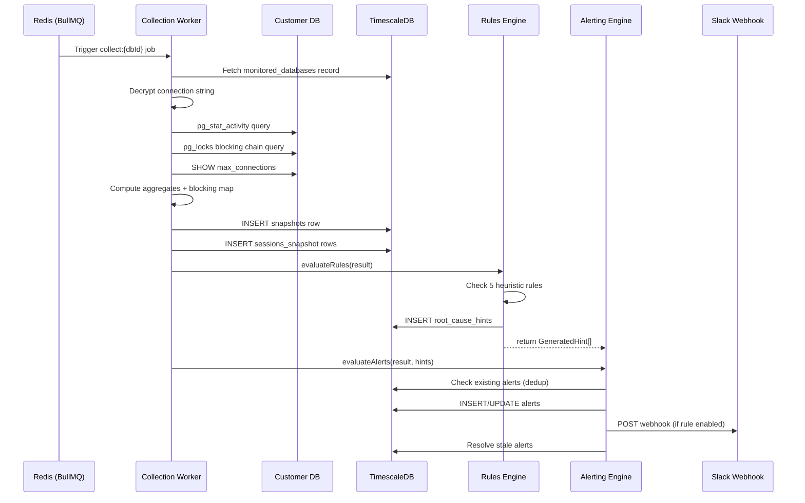
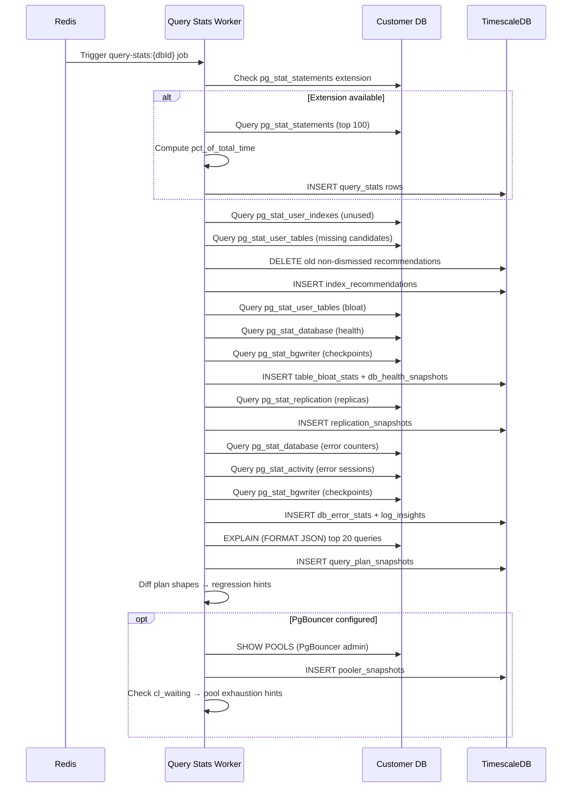

# PG Vitals — Detailed Technical Specification & Codebase Walkthrough

> **Version:** 0.6.0 | **Last Updated:** 2026-08-19  
> **Status:** All product phases 1–12 implemented. Includes Phase 12 Production DBA Sentinel Suite: Replication Slot WAL Retention Sentinel, Invalid (`indisvalid = false`) & Redundant Index Detection, B-Tree Index Bloat Estimator, Checkpoint Sync vs. Write Breakdown, WAL Velocity (MB/min), Archiver Health, HOT Update Efficiency, and Cascading Lock Queue Storm Sentinel. Test suite contains 115 tests across 12 test suites.

---

## Table of Contents

1. [Product Summary](#1-product-summary)
2. [Architecture Overview](#2-architecture-overview)
3. [Monorepo Structure](#3-monorepo-structure)
4. [Technology Stack](#4-technology-stack)
5. [Database Schema (packages/db)](#5-database-schema-packagesdb)
6. [Collector Service (apps/collector)](#6-collector-service-appscollector)
7. [Web Dashboard (apps/web)](#7-web-dashboard-appsweb)
8. [API Reference](#8-api-reference)
9. [Data Flow Walkthrough](#9-data-flow-walkthrough)
10. [Design System](#10-design-system)
11. [Infrastructure & DevOps](#11-infrastructure--devops)
12. [Current State vs. Product Spec](#12-current-state-vs-product-spec)
13. [Known Gaps & Technical Debt](#13-known-gaps--technical-debt)

---

## 1. Product Summary

**PG Vitals** is a PostgreSQL monitoring tool that goes beyond surfacing metrics — it traces database-level problems back to the application service/code path that caused them and provides plain-English root-cause hints with actionable fixes.

### Target Users
- Backend engineers, DevOps/SRE, and engineering managers
- Small-to-mid teams (5–50 engineers) running PostgreSQL in production without a dedicated DBA

### Core Differentiator
Unlike pganalyze, pgHero, or Datadog, PG Vitals correlates **database-level symptoms** (idle connections, slow queries, lock waits) with **application-level context** (`application_name`, endpoint, connection pool config) and produces **plain-English root cause + fix** — not just a chart.

### Scope
- PostgreSQL only (not multi-engine)
- Not a general APM, BI tool, or managed hosting product
- Monitors databases the customer already hosts elsewhere

---

## 2. Architecture Overview

```
┌───────────────────────────┐
│  Customer PostgreSQL DB    │  (read-only role: monitor_readonly)
│  (external, customer-owned)│
└────────────┬──────────────┘
             │ Scheduled polling via BullMQ:
             │   • 10s  — connections/sessions
             │   • 5min — query stats, index advisor, vacuum health
             ▼
┌────────────────────────────┐
│  Collector Service          │  Fastify API + BullMQ Workers
│  (apps/collector)           │  Port 3001
│  ├─ Connection Collector    │  → pg_stat_activity + pg_locks
│  ├─ Rules Engine            │  → heuristic root-cause hints
│  ├─ Alerting Engine         │  → dedup, cooldown, Slack + Email + PagerDuty + Teams + Webhook notify
│  ├─ Query Stats Collector   │  → pg_stat_statements
│  ├─ Index Advisor           │  → unused/missing index detection
│  ├─ Vacuum Health Collector │  → pg_stat_user_tables, pg_stat_database
│  ├─ Replication Collector   │  → pg_stat_replication, LSN diff
│  ├─ Log Insights Collector  │  → pg_stat_database errors, deadlocks
│  ├─ Plan Regression Collector│  → EXPLAIN capture + plan shape diffing
│  ├─ PgBouncer Collector     │  → SHOW POOLS metrics + pool exhaustion
│  ├─ Schema Diff Collector   │  → information_schema DDL change detection
│  └─ Data Retention          │  → tier-based purge (Free=1d, Pro=30d, Team=90d)
└────────────┬──────────────┘
             │ Writes via Drizzle ORM
             ▼
┌────────────────────────────┐     ┌─────────────────────┐
│  TimescaleDB (PG16)         │     │  Redis 7             │
│  Application database       │     │  BullMQ job queue     │
│  (packages/db)              │     │  Port 6379            │
│  Port 5432                  │     └─────────────────────┘
└────────────┬──────────────┘
             │ API calls (fetch)
             ▼
┌────────────────────────────┐
│  Web Dashboard (Next.js 15) │
│  (apps/web)                 │
│  Port 3000                  │
│  ├─ Dashboard (home)        │
│  ├─ Database Detail + Sessions│
│  ├─ Alerts Management       │
│  ├─ Query Performance       │
│  ├─ Index Advisor           │
│  ├─ Vacuum & DB Health      │
│  ├─ Log Insights            │
│  ├─ Team Settings           │
│  └─ Billing Settings        │
└────────────────────────────┘
```

### Communication Pattern

| From | To | Protocol |
|------|-----|----------|
| Collector → Customer DB | `postgres` (ephemeral connections via `postgres.js`) | Read-only SQL |
| Collector → TimescaleDB | `drizzle-orm` over `postgres.js` (persistent pool) | SQL |
| Collector → Redis | `ioredis` | BullMQ protocol |
| Web → Collector | `fetch()` over HTTP | REST JSON |
| Collector → Slack | `fetch()` | Webhook POST |
| Collector → Email (SMTP) | `nodemailer` | SMTP/TLS |
| Collector → PagerDuty | `fetch()` | Events API v2 POST |
| Collector → Teams | `fetch()` | Adaptive Cards webhook POST |
| Collector → Generic Webhook | `fetch()` | JSON POST + HMAC-SHA256 signature |

---

## 3. Monorepo Structure

```
pgvitals/
├── apps/
│   ├── collector/          # Fastify backend + BullMQ workers
│   │   ├── src/
│   │   │   ├── index.ts              # Entry point — Fastify server + scheduler startup
│   │   │   ├── config.ts             # Environment variable loader
│   │   │   ├── routes/
│   │   │   │   ├── index.ts          # Route registrar
│   │   │   │   ├── databases.ts      # CRUD for monitored databases
│   │   │   │   ├── monitoring.ts     # Overview, sessions, snapshots, hints
│   │   │   │   ├── alerts.ts         # Alert CRUD, rules CRUD, test notifications
│   │   │   │   ├── queries.ts        # Query stats, EXPLAIN capture
│   │   │   │   ├── indexes.ts        # Index recommendations, dismiss/restore
│   │   │   │   ├── health.ts         # Vacuum stats, DB health snapshots
│   │   │   │   ├── replication.ts    # Replication lag monitor
│   │   │   │   ├── log-insights.ts   # Log insight events + error stats
│   │   │   │   ├── org.ts            # Organization & team member management
│   │   │   │   ├── billing.ts        # Billing/subscription routes
│   │   │   │   ├── schema-events.ts  # Schema change event history
│   │   │   │   └── pooler.ts         # PgBouncer pool metrics & history
│   │   │   ├── collector/
│   │   │   │   ├── scheduler.ts      # BullMQ queue/worker lifecycle
│   │   │   │   ├── connection-collector.ts  # pg_stat_activity + pg_locks polling
│   │   │   │   ├── rules-engine.ts   # 5 heuristic rules → root-cause hints
│   │   │   │   ├── query-stats-collector.ts # pg_stat_statements polling
│   │   │   │   ├── explain-capture.ts      # On-demand EXPLAIN plan capture
│   │   │   │   ├── index-advisor.ts  # Unused/missing index detection
│   │   │   │   ├── vacuum-health-collector.ts # Table bloat + DB health metrics
│   │   │   │   ├── query-suggestions.ts     # AI-style query optimization hints
│   │   │   │   ├── replication-collector.ts  # pg_stat_replication polling
│   │   │   │   ├── log-insights-collector.ts # Error/deadlock/conflict tracking
│   │   │   │   ├── plan-regression-collector.ts # EXPLAIN plan shape tracking
│   │   │   │   ├── pooler-collector.ts       # PgBouncer SHOW POOLS metrics
│   │   │   │   ├── schema-diff-collector.ts  # DDL change detection via diffing
│   │   │   │   ├── hypopg-simulator.ts       # HypoPG hypothetical index simulation
│   │   │   │   └── retention.ts      # Tier-based data purge
│   │   │   ├── alerting/
│   │   │   │   ├── engine.ts         # Alert evaluation, dedup, fire/resolve
│   │   │   │   ├── fingerprint.ts    # Alert deduplication fingerprints
│   │   │   │   ├── notifier.ts       # Slack webhook sender
│   │   │   │   ├── email-notifier.ts # Email SMTP sender (Nodemailer)
│   │   │   │   └── webhook-notifier.ts # PagerDuty, Teams, generic webhook senders
│   │   │   ├── middleware/
│   │   │   │   ├── auth.ts           # Clerk JWT verification + dev fallback
│   │   │   │   └── plan-limits.ts    # Plan-based feature gating
│   │   │   └── lib/
│   │   │       ├── encryption.ts     # AES-256-GCM encrypt/decrypt
│   │   │       ├── safe-query.ts     # Read-only SQL execution safety net
│   │   │       ├── redact-query.ts   # Query text literal redaction (PII)
│   │   │       └── cost-model.ts     # Cost-per-query USD estimation
│   │   ├── tests/                    # Vitest unit tests (80 tests, 5 suites)
│   │   │   ├── encryption.test.ts
│   │   │   ├── redact-query.test.ts
│   │   │   ├── cost-model.test.ts
│   │   │   ├── fingerprint.test.ts
│   │   │   └── safe-query.test.ts
│   │   ├── package.json
│   │   └── tsconfig.json
│   │
│   └── web/                # Next.js 15 dashboard
│       ├── src/app/
│       │   ├── layout.tsx            # Root layout + sidebar navigation
│       │   ├── page.tsx              # Dashboard home — database cards
│       │   ├── globals.css           # Full design system (~25KB)
│       │   ├── lib/
│       │   │   ├── api.ts            # Type-safe API client (all endpoints)
│       │   │   └── useChartColors.ts # Theme-aware chart color hook
│       │   ├── components/
│       │   │   ├── ConnectionGauge.tsx  # SVG radial gauge
│       │   │   ├── ConnectionChart.tsx  # Time-series connection chart
│       │   │   ├── SessionsTable.tsx    # Sortable/filterable sessions table
│       │   │   ├── SessionGroups.tsx    # Sessions grouped by app/user/state
│       │   │   ├── HintCard.tsx         # Root-cause hint display
│       │   │   ├── StatsCard.tsx        # Metric stat card
│       │   │   ├── StatusBadge.tsx      # Environment/state badge
│       │   │   ├── AlertBanner.tsx      # Active alert notification
│       │   │   ├── AlertHistory.tsx     # Alert history timeline
│       │   │   └── ThemeToggle.tsx      # Dark/light mode toggle
│       │   └── databases/
│       │       ├── new/page.tsx         # Add database form
│       │       └── [id]/
│       │           ├── page.tsx         # Database detail dashboard
│       │           ├── alerts/page.tsx  # Alert rules + history
│       │           ├── queries/page.tsx # Query performance + EXPLAIN
│       │           ├── indexes/page.tsx # Index recommendations + HypoPG simulation
│       │           ├── health/page.tsx  # Vacuum & DB health
│       │           ├── logs/page.tsx    # Log insights — errors, deadlocks
│       │           ├── costs/page.tsx   # Query cost estimator dashboard
│       │           ├── plans/page.tsx   # Plan regression detection timeline
│       │           ├── pooler/page.tsx  # PgBouncer pool stats dashboard
│       │           └── schema/page.tsx  # Schema change event log
│       │   ├── onboarding/
│       │   │   └── page.tsx            # 7-step onboarding wizard
│       │   └── settings/
│       │       ├── billing/page.tsx     # Billing management
│       │       └── team/page.tsx        # Organization & team settings
│       ├── package.json
│       ├── next.config.ts
│       └── tsconfig.json
│
├── packages/
│   └── db/                 # Shared Drizzle ORM schema + migrations
│       ├── src/
│       │   ├── index.ts              # DB connection + re-exports
│       │   ├── migrate.ts            # Migration runner + hypertable setup
│       │   ├── seed.ts               # Dev seed data
│       │   └── schema/
│       │       ├── index.ts           # Barrel re-export
│       │       ├── organizations.ts   # orgs, users, monitored_databases
│       │       ├── monitoring.ts      # snapshots, sessions_snapshot, root_cause_hints
│       │       ├── alerting.ts        # alerts, alert_rules
│       │       ├── query-performance.ts # query_stats, explain_captures
│       │       ├── index-advisor.ts   # index_recommendations
│       │       ├── vacuum-health.ts   # table_bloat_stats, db_health_snapshots, table_size_history
│       │       ├── replication.ts     # replication_snapshots
│       │       ├── log-insights.ts    # log_insights, db_error_stats
│       │       ├── schema-events.ts   # schema_events, schema_snapshots
│       │       ├── query-plans.ts     # query_plan_snapshots
│       │       └── pooler.ts          # pooler_snapshots
│       ├── drizzle/                   # Generated SQL migrations (12 files)
│       ├── drizzle.config.ts
│       ├── package.json
│       └── tsconfig.json
│
├── specs/                  # Product specifications
│   ├── postgres-monitoring-product-spec.md
│   ├── dark_mode.txt
│   └── light_mode.txt
│
├── docker-compose.yml      # Local dev: TimescaleDB + Redis
├── vitest.config.ts        # Vitest test configuration
├── package.json            # Workspace root scripts
├── pnpm-workspace.yaml     # pnpm workspace config
├── tsconfig.base.json      # Shared TypeScript config
├── .env.example
├── how_to_run.md
└── deployment_guide.md
```

### Workspace Packages

| Package | Name | Purpose |
|---------|------|---------|
| `apps/collector` | `@pgvitals/collector` | Backend API + data collection workers |
| `apps/web` | `@pgvitals/web` | Next.js web dashboard |
| `packages/db` | `@pgvitals/db` | Shared database schema, migrations, seed |

---

## 4. Technology Stack

| Layer | Technology | Version | Purpose |
|-------|-----------|---------|---------|
| **Runtime** | Node.js | ≥ 20 | Server runtime |
| **Package Manager** | pnpm | ≥ 9 | Monorepo workspace management |
| **Language** | TypeScript | 5.7+ | Strict mode, ESNext modules, bundler resolution |
| **Backend Framework** | Fastify | 5.3 | HTTP server + route plugins |
| **ORM** | Drizzle ORM | 0.44 | Type-safe SQL for TimescaleDB |
| **DB Driver** | postgres.js | 3.4 | PostgreSQL wire protocol (both app DB + customer DB) |
| **Job Queue** | BullMQ | 5.34 | Repeatable job scheduling |
| **Cache/Queue** | Redis | 7 (Alpine) | BullMQ backing store |
| **Time-series DB** | TimescaleDB | latest-pg16 | Application data storage (hypertables) |
| **Frontend** | Next.js | 15 | React framework + App Router |
| **Styling** | Vanilla CSS | — | Custom design system with CSS variables |
| **Charts** | Recharts | 2.x | Area charts, reference lines, tooltips + custom SVG gauges |
| **Testing** | Vitest | 4.1 | Unit test framework (80 tests across 5 suites) |
| **Logging** | Pino | 9.6 | Structured JSON logging |
| **Encryption** | Node crypto | built-in | AES-256-GCM for connection strings |

---

## 5. Database Schema (packages/db)

### 5.1 Entity Relationship Diagram

```mermaid
erDiagram
    organizations ||--o{ users : has
    organizations ||--o{ monitored_databases : owns
    monitored_databases ||--o{ snapshots : generates
    monitored_databases ||--o{ sessions_snapshot : captures
    monitored_databases ||--o{ root_cause_hints : triggers
    monitored_databases ||--o{ alerts : fires
    monitored_databases ||--o{ alert_rules : configures
    monitored_databases ||--o{ query_stats : tracks
    monitored_databases ||--o{ explain_captures : stores
    monitored_databases ||--o{ index_recommendations : detects
    monitored_databases ||--o{ table_bloat_stats : measures
    monitored_databases ||--o{ db_health_snapshots : monitors
    monitored_databases ||--o{ table_size_history : tracks
    monitored_databases ||--o{ replication_snapshots : monitors
    monitored_databases ||--o{ log_insights : captures
    monitored_databases ||--o{ db_error_stats : tracks
    monitored_databases ||--o{ schema_events : detects
    monitored_databases ||--o{ schema_snapshots : stores
    monitored_databases ||--o{ query_plan_snapshots : tracks
    monitored_databases ||--o{ pooler_snapshots : monitors
```



### 5.2 Tables — Detailed Schema

#### Core Tables

| Table | Type | PK Strategy | Partitioned |
|-------|------|-------------|-------------|
| `organizations` | Regular | UUID | No |
| `users` | Regular | UUID | No |
| `monitored_databases` | Regular | UUID | No |

#### Time-Series Tables (TimescaleDB Hypertables)

| Table | Partition Column | Purpose |
|-------|-----------------|---------|
| `snapshots` | `timestamp` | Aggregate connection metrics per poll |
| `sessions_snapshot` | `timestamp` | Per-session detail at each snapshot |
| `query_stats` | `captured_at` | Per-query metrics from pg_stat_statements |
| `table_bloat_stats` | `captured_at` | Table-level vacuum/bloat metrics |
| `table_size_history` | `captured_at` | Daily table size samples for growth forecast |
| `replication_snapshots` | `captured_at` | Per-replica lag metrics from pg_stat_replication |
| `log_insights` | `captured_at` | Parsed error/warning events (deadlocks, conflicts, etc.) |
| `db_error_stats` | `captured_at` | Aggregate error counters from pg_stat_database |
| `query_plan_snapshots` | `captured_at` | EXPLAIN plan shapes for regression detection |
| `pooler_snapshots` | `captured_at` | PgBouncer pool metrics (cl_active, cl_waiting, etc.) |

> [!NOTE]
> Hypertables use composite primary keys `(id, partition_column)` because TimescaleDB requires the partitioning column in any unique index.

#### Regular Tables

| Table | Purpose |
|-------|---------|
| `root_cause_hints` | Heuristic-generated root-cause diagnostics |
| `alerts` | Fired alert instances (with resolve tracking) |
| `alert_rules` | Per-database alert configuration (thresholds, channels) |
| `explain_captures` | On-demand EXPLAIN plan captures with warnings |
| `index_recommendations` | Unused/missing index suggestions |
| `db_health_snapshots` | Cluster-wide health metrics (cache hit, checkpoints, etc.) |
| `query_suggestions` | AI-style query optimization suggestions |
| `schema_events` | DDL change events detected via schema diffing |
| `schema_snapshots` | Periodic schema state snapshots for diffing |

### 5.3 Enums

| Enum | Values |
|------|--------|
| `plan_tier` | `free`, `pro`, `team` |
| `user_role` | `owner`, `admin`, `member` |
| `environment` | `production`, `staging`, `development` |
| `alert_type` | `idle_in_transaction`, `connection_hog`, `blocking_chain`, `connection_exhaustion`, `connection_spike`, `replication_lag`, `monitoring_failure`, `pool_exhaustion` |
| `alert_severity` | `warning`, `critical` |
| `recommendation_type` | `unused`, `missing` |
| `log_severity` | `error`, `warning`, `info` |

### 5.4 Key Schema Details

**`monitored_databases`** — Central entity linking all monitoring data:
- `connection_string_encrypted` — AES-256-GCM encrypted (format: `iv:authTag:ciphertext`)
- `pgbouncer_connection_string_encrypted` — Optional AES-256-GCM encrypted PgBouncer admin connection
- `is_active` — Controls whether the scheduler polls this database (stored as varchar `"true"/"false"`)
- All child tables cascade on delete

**`snapshots`** — Stores aggregated connection metrics:
- `connection_count`, `active_count`, `idle_count`, `idle_in_txn_count`, `idle_in_txn_aborted_count`
- `max_connections` — from `SHOW max_connections`
- `raw_payload` — Full sessions + blocking pairs as JSONB

**`sessions_snapshot`** — Per-session detail:
- `blocking_pid` — nullable FK-like reference to the blocking session
- No FK to `snapshots` (TimescaleDB doesn't support FK to hypertables)
- `query_text` — truncated to 500 chars

**`query_stats`** — Per-query fingerprint metrics:
- `pct_of_total_time` — precomputed percentage of total database time
- Sorted by `total_exec_time DESC`, limited to top 100 per poll

### 5.5 Migrations

12 migration files in `drizzle/`:

| Migration | Content |
|-----------|---------|
| `0000_ordinary_the_executioner.sql` | Initial schema: orgs, users, monitored_databases, snapshots, sessions_snapshot, root_cause_hints |
| `0001_lovely_big_bertha.sql` | Alerting: alerts, alert_rules, enums |
| `0002_add_connection_spike_enum.sql` | Add `connection_spike` to alert_type enum |
| `0002_bitter_robbie_robertson.sql` | Query performance: query_stats, explain_captures |
| `0003_late_meltdown.sql` | Index advisor: index_recommendations |
| `0004_loving_lester.sql` | Vacuum health: table_bloat_stats, db_health_snapshots |
| `0005_query_suggestions.sql` | Query suggestions table |
| `0006_table_size_history.sql` | Table size history for growth forecast |
| `0007_db_health_txid.sql` | TX ID wraparound fields in db_health_snapshots |
| `0008_replication_snapshots.sql` | Replication lag monitoring snapshots |
| `0009_log_insights.sql` | Log insights + error stats tables |
| `0010_spec_sync_gaps.sql` | Replication lag + monitoring failure alert types, bloat estimation columns |
| `0011_phase_8_10_features.sql` | Schema events, query plan snapshots, pooler snapshots, PgBouncer connection field, pool exhaustion alert type |
| `0012_alert_feedback.sql` | Alert feedback columns (feedback enum + feedback_at timestamp) |

The `migrate.ts` script runs Drizzle migrations **then** creates TimescaleDB hypertables idempotently via raw SQL.

---

## 6. Collector Service (apps/collector)

### 6.1 Entry Point & Server

**File:** `src/index.ts`

Startup sequence:
1. Load environment via `dotenv/config`
2. Create Fastify instance with Pino structured logging
3. Register CORS (all origins in dev)
4. Register all route plugins
5. Add `/health` endpoint
6. Start BullMQ scheduler (`startScheduler()`)
7. Start HTTP server on `COLLECTOR_PORT` (default 3001)

Graceful shutdown (`SIGINT`/`SIGTERM`): stops scheduler → closes Fastify → exits.

### 6.2 Configuration

**File:** `src/config.ts`

| Config Key | Env Var | Default | Required |
|-----------|---------|---------|----------|
| `databaseUrl` | `DATABASE_URL` | — | ✅ |
| `redisUrl` | `REDIS_URL` | `redis://localhost:6379` | ❌ |
| `collectorPort` | `COLLECTOR_PORT` | `3001` | ❌ |
| `pollingIntervalMs` | `POLLING_INTERVAL_MS` | `10000` (10s) | ❌ |
| `queryStatsIntervalMs` | `QUERY_STATS_INTERVAL_MS` | `300000` (5min) | ❌ |
| `encryptionKey` | `ENCRYPTION_KEY` | — | ✅ |
| `dashboardBaseUrl` | `DASHBOARD_BASE_URL` | `http://localhost:3000` | ❌ |

### 6.3 Scheduler (BullMQ)

**File:** `src/collector/scheduler.ts`

Two separate BullMQ queues:

| Queue | Job Name Pattern | Interval | Worker Concurrency |
|-------|-----------------|----------|-------------------|
| `pgvitals-collect` | `collect:{dbId}` | 10s | 5 |
| `pgvitals-query-stats` | `query-stats:{dbId}` | 5min | 3 |

**Connection poll job** (10s cycle):
```
collectSnapshot() → evaluateRules() → evaluateAlerts()
```

**Query stats job** (5min cycle):
```
collectQueryStats() → analyzeIndexes() → collectVacuumHealth()
  → analyzeQuerySuggestions() → collectReplicationLag() → collectLogInsights()
  → collectPlanSnapshots() → collectPoolerStats()
```

**Daily jobs** (24h cycle):
```
purgeOldData() — tier-based retention (Free=1d, Pro=30d, Team=90d)
collectSchemaDiff() — DDL change detection for all active databases
```
- On startup: clears stale repeatable jobs → schedules for all active databases
- `scheduleDatabase()` / `unscheduleDatabase()` — called when DBs are added/removed via API
- `purgeOldData()` — runs on startup + every 24h via `setInterval`

### 6.4 Connection Collector

**File:** `src/collector/connection-collector.ts`

**Queries executed on customer DB** (read-only):
1. **`pg_stat_activity`** — all sessions for the current database, excluding own PID. Captures: pid, usename, application_name, client_addr, state, state_duration_seconds (computed from `now() - state_change`), query_text (truncated to 500 chars), wait events.
2. **`pg_locks` + `pg_stat_activity` join** — builds blocker→blocked pairs by matching lock attributes.
3. **`SHOW max_connections`** — gets the configured connection limit.

**Output pipeline:**
1. Computes aggregates (active/idle/idle-in-txn counts)
2. Builds blocking map (blocked_pid → blocking_pid)
3. Inserts into `snapshots` table (with raw payload as JSONB)
4. Inserts per-session rows into `sessions_snapshot`
5. Returns `CollectionResult` for downstream rules/alerting

### 6.5 Rules Engine

**File:** `src/collector/rules-engine.ts`

6 heuristic rules evaluated per snapshot:

| # | Rule | Severity | Threshold | What It Detects |
|---|------|----------|-----------|-----------------|
| 1 | `idle_in_transaction_long` | warning | >300s | Sessions stuck in `idle in transaction` state |
| 2 | `connection_hog` | warning | >70% of max_connections from one app | Single application consuming too many connections |
| 3 | `blocking_chain_long` | critical | >30s | Lock chains where blocked session waits >30s |
| 4 | `connection_exhaustion` | critical | >80% of max_connections | Approaching connection limit; checks for pooler |
| 5 | `connection_spike` | warning | >50% increase from previous snapshot (min 10 conns) | Sudden jump in connection count |
| 6 | `micro_query_lock_storm` | critical / warning | ≥3 concurrent write/lock sessions or >15 calls/sec consuming >20% CPU | High-frequency micro-queries clashing on row/table locks and saturating CPU |

Each rule generates `GeneratedHint` objects that are:
- Inserted into `root_cause_hints` table
- Passed to the alerting engine for notification

### 6.6 Alerting System

#### Alerting Engine (`src/alerting/engine.ts`)

**Pipeline per collection cycle:**
1. Fetch enabled `alert_rules` for the database
2. Map rule-engine hints to alert types via `hintToAlertType()`
3. Generate deduplication fingerprint via `generateFingerprint()`
4. For each hint:
   - If matching active alert exists and cooldown elapsed → re-notify
   - If no matching alert → insert new alert + notify
5. Resolve alerts no longer detected (fingerprint not in current cycle)

#### Fingerprinting (`src/alerting/fingerprint.ts`)

Generates unique strings per alert type:
| Alert Type | Fingerprint Pattern |
|------------|-------------------|
| idle_in_transaction | `idle_in_txn:{dbId}:{pid}` |
| connection_hog | `conn_hog:{dbId}:{app_name}` |
| blocking_chain | `block_chain:{dbId}:{blocked_pid}:{blocking_pid}` |
| connection_exhaustion | `conn_exhaust:{dbId}` |
| connection_spike | `conn_spike:{dbId}` |
| replication_lag | `repl_lag:{dbId}:{replicaName}` |
| monitoring_failure | `monitor_fail:{dbId}` |
| pool_exhaustion | `pool_exhaust:{dbId}:{poolName}` |

#### Notifier (`src/alerting/notifier.ts`)

- Slack Incoming Webhook via `fetch()` POST
- Uses Slack Block Kit with color-coded attachments:
  - 🔴 Critical = `#EF4444`
  - 🟡 Warning = `#F59E0B`
- Includes: severity, alert type, database name, environment, root-cause hint, timestamp
- Test notification feature with 🧪 purple attachment

#### Email Notifier (`src/alerting/email-notifier.ts`)

- SMTP email sending via `nodemailer`
- Professional HTML templates with inline CSS:
  - Severity-colored header (🔴 critical = `#EF4444`, 🟡 warning = `#F59E0B`)
  - Root-cause hint section
  - Alert details key/value table
  - Dashboard link button
  - Timestamp footer
- Test email feature with 🧪 brand-colored header (`#6366F1`)
- Supports any SMTP server (Gmail, AWS SES, company SMTP, etc.)

#### Webhook Notifier (`src/alerting/webhook-notifier.ts`)

3 additional notification channels:

**Generic Webhook:**
- Sends JSON POST to any HTTP endpoint
- Optional HMAC-SHA256 signature via `X-PgVitals-Signature: sha256=<hex>` header
- Retries once on 5xx responses
- User-Agent: `PgVitals-Alert/1.0`

**PagerDuty:**
- Posts to PagerDuty Events API v2 (`events.pagerduty.com/v2/enqueue`)
- Maps alert severity to PagerDuty severity (critical/warning/error/info)
- Sets `routing_key`, `dedup_key` (from alert fingerprint), `source`, `component`
- Sends `resolve` events when alerts are resolved

**Microsoft Teams:**
- Posts Adaptive Cards to Teams Incoming Webhook connector
- Color-coded severity header (red for critical, orange for warning)
- Includes: alert type, database name, environment, root-cause hint, timestamp

### 6.7 Query Stats Collector

**File:** `src/collector/query-stats-collector.ts`

1. Checks if `pg_stat_statements` extension is installed
2. Queries top 100 queries by `total_exec_time DESC`
3. Computes `pct_of_total_time` for each query
4. Inserts into `query_stats` table

### 6.8 EXPLAIN Capture

**File:** `src/collector/explain-capture.ts`

- Triggered on-demand via API (not automatic)
- Uses `EXPLAIN (FORMAT JSON, BUFFERS, COSTS)` — **no ANALYZE** for safety
- Parses plan tree recursively, detecting 4 warning types:

| Warning | Condition |
|---------|-----------|
| `seq_scan_large_table` | Seq Scan with >10,000 estimated rows |
| `nested_loop_high_rows` | Nested Loop producing >10,000 rows |
| `high_cache_miss` | Read blocks > hit blocks |
| `sort_disk_spill` | Sort method contains "external" |

### 6.8b SQL-Aware Index & Query Advisor

**Files:** `src/collector/sql-advisor.ts`, `apps/web/src/app/lib/sqlAdvisor.ts`

Parses SQL statements from `pg_stat_statements` and query suggestions to generate tailored, non-blocking index recommendations and quantify execution savings both server-side (collector) and client-side (web):

1. **Predicate Extraction**: Extracts equality WHERE columns, range/IN filters, and partial conditions (e.g. `IS NOT NULL`, `IS NULL`).
2. **Projection Extraction**: Extracts selected columns to recommend covering indexes via `INCLUDE (...)` for Index-Only Scans with zero heap fetches.
3. **DDL Generation**: Produces safe `CREATE INDEX CONCURRENTLY idx_{table}_{cols}_opt ON "{table}" (...) INCLUDE (...) WHERE ...;`.
4. **Quantified Savings**: Calculates cumulative database execution time in hours (`calls * meanTimeMs`) and estimated savings percentage based on target index lookup latency (~0.05ms).
5. **Frontend Integration**: Provides one-click `📋 Copy DDL`, `🧪 Test in HypoPG`, and `🗂️ View in Index Advisor` actions on suggestion cards and the Statement Inspector drawer.

### 6.8c Query Suggestions Engine & Statement-Aware Optimizer

**File:** `src/collector/query-suggestions.ts`

Analyzes historical query statistics to generate actionable, statement-aware architectural optimization advice:

| Rule & Pattern | Detection Logic | Statement-Specific Tailored Advice |
| :--- | :--- | :--- |
| **Micro-Query Lock / CPU Storm** | Velocity $\ge 15$/sec or calls $> 1500$, mean time $< 150$ms, $\ge 20\%$ total DB time | Distinguishes read vs. write/lock contention. Suggests connection throttling, partial indexes, or bulk updates. |
| **High-Frequency Writes (`INSERT`)** | `INSERT INTO ...`, calls $> 500$, mean time $< 15$ms | Recommends **multi-row `VALUES (...), (...)` batching**, bulk loading with **`COPY`**, or grouping rows in transaction blocks to eliminate network roundtrips and WAL commit overhead. |
| **High-Frequency Updates (`UPDATE`)** | `UPDATE ...`, calls $> 500$, mean time $< 15$ms | Recommends batch updates via `UPDATE ... FROM (VALUES (...))` or `WHERE id = ANY(...)`. |
| **High-Frequency Deletes (`DELETE`)** | `DELETE FROM ...`, calls $> 500$, mean time $< 15$ms | Recommends chunked deletions and `WHERE id = ANY(...)` array filtering. |
| **N+1 Read Point-Lookups (`SELECT`)** | `SELECT ...`, calls $> 500$, mean time $< 15$ms | Suggests application-level batching with `WHERE id = ANY(...)` / `IN (...)`, `JOIN`s, or generates covering index DDL. |
| **Cache Miss / Disk Read Ratio** | $> 100$ blocks and `shared_blks_read > shared_blks_hit` | Recommends dedicated index creation or tuning `shared_buffers`. |
| **Disk Temp Spill** | `temp_blks_written > 0` | Recommends tuning `work_mem` or creating sorted/composite indexes. |

### 6.9 Index Advisor

**File:** `src/collector/index-advisor.ts`

Two detection modes:

**Unused Indexes:**
- Queries `pg_stat_user_indexes` for indexes with 0 scans
- Excludes primary keys, unique constraints, TimescaleDB internals
- Generates `DROP INDEX` DDL suggestions
- Impact rating based on index size (>50MB = high)

**Missing Indexes:**
- Queries `pg_stat_user_tables` for tables with high seq_scan and >1000 rows
- Generates template `CREATE INDEX CONCURRENTLY` suggestions
- Impact rating based on sequential scan count

Both modes clear previous un-dismissed recommendations before regenerating.

### 6.10a HypoPG Index Simulator

**File:** `src/collector/hypopg-simulator.ts`

Allows users to simulate hypothetical indexes using the HypoPG extension (opt-in):

1. Checks if HypoPG extension is installed (`SELECT * FROM hypopg()`)
2. Creates a session-scoped hypothetical index via `SELECT hypopg_create_index(ddl)`
3. Runs `EXPLAIN (FORMAT JSON)` on a user-provided test query before and after
4. Compares plan costs and node types (e.g., Seq Scan → Index Scan)
5. Cleans up via `SELECT hypopg_reset()`
6. Returns: `costBefore`, `costAfter`, `costReductionPct`, `planBefore`, `planAfter`, `usesIndex`
7. All operations use a single connection (HypoPG indexes are session-scoped)

Exposed via `POST /api/databases/:id/indexes/simulate` with `{ indexDdl, testQuery }` body.

### 6.10 Vacuum Health Collector

**File:** `src/collector/vacuum-health-collector.ts`

Collects two types of data:

**Table Bloat Stats** (per-table):
- n_live_tup, n_dead_tup, dead_tup_ratio
- Table/total size in bytes
- Last vacuum/autovacuum/analyze timestamps
- Vacuum/autovacuum counts
- Sequential vs. index scan counts

**Database Health Snapshots** (cluster-wide):
- Cache hit ratio (from `pg_stat_database`)
- Checkpoints (requested + timed) from `pg_stat_bgwriter`
- Buffer stats, DB size, backend count
- Transaction commit/rollback counts
- Conflicts, deadlocks, temp file bytes

### 6.11 Data Retention

**File:** `src/collector/retention.ts`

- **Tier-based retention windows:**
  - Free: 1-day retention
  - Pro: 30-day retention
  - Team: 90-day retention
- Runs on startup + every 24h
- Determines tier per monitored database via org → plan lookup
- Purges from 14 tables in order:
  1. `sessions_snapshot` → 2. `snapshots` → 3. `root_cause_hints` → 4. `alerts` (resolved only) → 5. `query_stats` → 6. `explain_captures` → 7. `index_recommendations` (dismissed only) → 8. `table_bloat_stats` → 9. `db_health_snapshots` → 10. `query_suggestions` → 11. `table_size_history` → 12. `replication_snapshots` → 13. `log_insights` → 14. `db_error_stats`

### 6.12 Replication Lag Collector

**File:** `src/collector/replication-collector.ts`

- Queries `pg_stat_replication` on each monitored database
- Computes byte lag via `pg_wal_lsn_diff(sent_lsn, replay_lsn)`
- Captures: replica name, state (streaming/catchup/startup), write/flush/replay lag intervals, client address
- Silently skips databases with no replicas (zero overhead)
- Inserts into `replication_snapshots` table

### 6.13 Log Insights Collector & Event Diagnostics Inspector

**Files:** `src/collector/log-insights-collector.ts`, `apps/web/src/app/databases/[id]/logs/page.tsx`

Collects error/warning signals from PostgreSQL system views and provides an interactive root cause diagnostics drawer:

| Source | What It Detects |
|--------|----------------|
| `pg_stat_database` | Deadlocks, replication conflicts, rollback rate (delta tracking) |
| `pg_stat_bgwriter` | Checkpoint pressure (high `checkpoints_req`) |
| `pg_stat_activity` | Aborted transactions (`idle in transaction (aborted)` state) |
| `pg_stat_activity` | Lock contention (sessions waiting on locks) |

**Event Diagnostics Inspector:**
- **Deadlock Analysis**: Explains circular lock dependencies, links to concurrent write queries (`?filter=dml`), and displays PostgreSQL engine logging parameters (`log_lock_waits = on`, `deadlock_timeout = '1s'`).
- **High Rollback Rate**: Details transaction constraint failures and lock timeouts.
- **Checkpoint Pressure**: Surfaces WAL sizing recommendations (`max_wal_size`, `checkpoint_completion_target`).
- **Health Tab Integration**: Active Deadlock Alert Banner and clickable `🔒 Deadlocks` metric card linking to `/databases/[id]/logs?filter=deadlock`.

Delta computation:
- Stores cumulative counters in `db_error_stats`
- Computes deltas between collection runs
- Handles counter resets (PostgreSQL restart)
- Only generates `log_insights` entries for significant changes

### 6.14 Multi-Factor Plan Regression Engine

**File:** `src/collector/plan-regression-collector.ts`

Detects structural execution plan changes, cost spikes, and degraded access paths:

1. **Snapshots**: Automatically captures `EXPLAIN (FORMAT JSON)` for top queries by total execution time.
2. **Multi-Factor Regression Scoring (`analyzePlanRegression`)**:
   - **Cost Surge**: Flags planner cost spikes $\ge 30\%$ as `warning` and $\ge 100\%$ as `critical`.
   - **Index Degradation**: Flags transitions from `Index Scan` / `Index Only Scan` to `Seq Scan`, surfacing the unindexed table name and row estimate.
   - **Join Degradation**: Flags transitions from `Hash Join` or `Merge Join` to `Nested Loop` with high row counts.
   - **Structural Shifts**: Hashes tree node paths (DFS order) to detect altered plan shapes.
3. **Actionable Remediation**: Generates plain-English root causes and one-click copyable SQL fix commands (e.g. `ANALYZE <table_name>;` to refresh stale planner statistics).
4. **Plan Flag Detection**: Captures `seq_scan_large_table` (>10,000 rows), `unindexed_filter`, and `nested_loop_high_rows`.
5. **Interactive Diffing (`PlanDiffVisualizer.tsx`)**: Side-by-side visual comparison between baseline and regressed execution plans with delta metrics ($\Delta$ cost %, $\Delta$ rows).
6. **On-Demand Capture**: Immediate `⚡ Capture Plan Now` action to execute live `EXPLAIN` and refresh snapshot history.

### 6.15 PgBouncer Collector

**File:** `src/collector/pooler-collector.ts`

Collects PgBouncer pool metrics. Only active when `pgbouncer_connection_string_encrypted` is configured:

1. Connects to PgBouncer admin console with `prepare: false` (PgBouncer doesn't support prepared statements)
2. Executes `SHOW POOLS` to get per-pool metrics
3. Stores snapshots in `pooler_snapshots` hypertable
4. Generates `pool_exhaustion` alerts when `cl_waiting > 0` (warning) or `cl_waiting > 5` (critical)
5. Silently skips databases with no PgBouncer connection configured

### 6.16 Schema Diff Collector

**File:** `src/collector/schema-diff-collector.ts`

Detects DDL changes (CREATE/DROP table/column/index) via periodic schema diffing:

1. Queries `information_schema.columns` and `pg_indexes` for current schema state
2. Stores structured snapshot in `schema_snapshots` table
3. Diffs against previous snapshot detecting:
   - Table additions/removals (`create_table`, `drop_table`)
   - Column additions/removals (`add_column`, `drop_column`)
   - Index additions/removals (`create_index`, `drop_index`)
4. Generates `schema_events` records for each detected change
5. Runs daily (not per-poll) to minimize overhead

### 6.17 Security Layer

**Encryption (`src/lib/encryption.ts`):**
- Algorithm: AES-256-GCM
- Key: 32-byte hex-encoded (`ENCRYPTION_KEY` env var)
- Format: `iv:authTag:ciphertext` (all hex)
- IV: 16 random bytes per encryption
- Auth tag: 16 bytes (GCM authentication)

**Safe Query (`src/lib/safe-query.ts`):**
- Validates SQL starts with `SELECT`, `SHOW`, `WITH`, or `EXPLAIN`
- Rejects any write operations at the code level (defense in depth)
- Creates ephemeral connections (max 1, idle timeout 5s)
- Configurable query timeout (default 10s, override per-call)

**Query Text Redaction (`src/lib/redact-query.ts`):**
- Strips literal values from SQL query text before storage
- Replaces: single-quoted strings → `$1`, numeric literals → `$N`, UUID patterns → `$UUID`, hex literals → `$HEX`, boolean literals → `$BOOL`
- Applied to `pg_stat_activity` query text during connection collection
- Prevents accidental PII/secret leakage in stored query text

**Cost-Per-Query Estimator (`src/lib/cost-model.ts`):**
- Estimates monthly IO + CPU cost per query in USD
- Default cost model based on AWS RDS gp3 pricing ($0.08/M IOPS, ~$0.26/hr vCPU)
- Customizable via API query parameters
- Extrapolates from snapshot window to monthly volume
- Results clearly labeled as directional estimates

---

## 7. Web Dashboard (apps/web)

### 7.1 Framework & Routing

- **Next.js 15** with App Router
- All pages are `"use client"` components (client-side rendering + fetch)
- Data fetching via `NEXT_PUBLIC_API_URL` → collector API
- 10-second auto-refresh intervals on dashboard pages

### 7.2 Pages

| Route | File | Description |
|-------|------|-------------|
| `/` | `page.tsx` | Dashboard home — grid of monitored databases with connection gauges |
| `/databases/new` | `databases/new/page.tsx` | Form to register a new database (name, connection string, environment) |
| `/databases/[id]` | `databases/[id]/page.tsx` | Database detail — overview stats, feature subnav, root blocker alert banner, auto-refresh controller, point-in-time session replay ("Time-Travel") mode with Prev/Next step scrubber, connection chart with click-to-replay & timeframe toggles (15m, 1h, 6h, 24h, 7d, ALL), searchable sessions table with state filters |
| `/databases/[id]/hints` | `databases/[id]/hints/page.tsx` | Root Cause Hints & Incident Logs — chronological log of heuristic rules engine detections, lock contention storms, KPI metrics, search, time range filtering, deep diagnostic inspector drawer with culprit SQL copy, and CSV/JSON export |
| `/databases/[id]/alerts` | `databases/[id]/alerts/page.tsx` | Alert rules + history + feedback (thumbs up/down) + multi-channel config (Slack, Email, PagerDuty, Teams, Webhook) |
| `/databases/[id]/queries` | `databases/[id]/queries/page.tsx` | Query performance — workload KPI strip, search & filter chips, sortable table with inline workload heat bars, statement detail drawer with SQL syntax formatting, copy button, dual-metric latency/volume trend charts, on-demand EXPLAIN & HypoPG simulation bridge |
| `/databases/[id]/indexes` | `databases/[id]/indexes/page.tsx` | Index advisor — default table view (toggleable to cards), reclaimable disk space & seq scan summary, search, sort, filter chips, CONCURRENTLY safe DDL, expandable indexdef, HypoPG simulation |
| `/databases/[id]/health` | `databases/[id]/health/page.tsx` | Health score banner (0-100) + 4-tab layout (Overview/VACUUM & Bloat/Storage/Replication) with search, sort, filter, expandable rows, copy-to-clipboard VACUUM commands, disk growth sparklines |
| `/databases/[id]/logs` | `databases/[id]/logs/page.tsx` | Log insights — errors, deadlocks, rollbacks |
| `/databases/[id]/costs` | `databases/[id]/costs/page.tsx` | Query cost estimator — monthly IO+CPU cost per query |
| `/databases/[id]/plans` | `databases/[id]/plans/page.tsx` | Plan regression timeline — multi-factor regression scoring, side-by-side diffing (`PlanDiffVisualizer`), SVG map tree (`PlanTreeVisualizer`), flat list (`PlanListView`), cost evolution chart, on-demand capture |
| `/databases/[id]/pooler` | `databases/[id]/pooler/page.tsx` | PgBouncer pool stats — active/waiting clients, pool utilization |
| `/databases/[id]/schema` | `databases/[id]/schema/page.tsx` | Schema change event log — DDL events with diffs |
| `/onboarding` | `onboarding/page.tsx` | 7-step onboarding wizard (connection validation, capability detection, setup SQL, Slack config) |
| `/settings/billing` | `settings/billing/page.tsx` | Billing/subscription management |
| `/settings/team` | `settings/team/page.tsx` | Organization & team member management |

### 7.3 Components

| Component | Purpose |
|-----------|---------|
| `Sidebar` | Collapsible navigation sidebar — client component with localStorage-persisted collapse state |
| `ConnectionGauge` | SVG radial gauge showing connection utilization % |
| `ConnectionChart` | Recharts time-series area chart for connection counts + schema change markers (ReferenceLine) |
| `SessionsTable` | Sortable, filterable table of active PostgreSQL sessions |
| `SessionGroups` | Sessions grouped by application_name, usename, or state |
| `PlanDiffVisualizer` | Dual-column side-by-side execution plan diff view with node difference highlights and delta metrics |
| `PlanTreeVisualizer` | SVG hierarchical execution plan tree map with interactive pan/zoom and collapsible nodes |
| `PlanListView` | Indented flat tabular breakdown of EXPLAIN execution nodes |
| `HintCard` | Root-cause hint card with severity indicator |
| `StatsCard` | Metric display card (value + label) |
| `StatusBadge` | Environment badge (production/staging/development) |
| `AlertBanner` | Active alert notification banner |
| `AlertHistory` | Timeline of past alerts with thumbs up/down feedback buttons |
| `ThemeToggle` | Dark/light mode toggle (persisted to `localStorage`) |

### 7.4 Collapsible Sidebar

The sidebar (`Sidebar.tsx`) is a client component with expand/collapse toggle:

- **Expanded:** 260px wide, shows icons + labels
- **Collapsed:** 68px wide, shows icons only with hover tooltips
- **Persistence:** Saved to `localStorage` key `pgvitals-sidebar-collapsed`
- **FOUC Prevention:** An inline `<script>` in `layout.tsx` sets `data-sidebar="collapsed"` and `data-no-transition` on `<html>` before first paint, using the same pattern as theme persistence
- **CSS Architecture:** All collapsed styling uses `[data-sidebar="collapsed"]` attribute selectors (not class names) so styles apply before React hydrates
- **Toggle Button:** Fixed-position circular button on the sidebar edge, slides with the sidebar via CSS `left` transition
- **Transitions:** Suppressed on initial page load via `[data-no-transition]` CSS rule, re-enabled after first `requestAnimationFrame` post-hydration

### 7.5 Query Suggestions Panel

The query suggestions panel on the Queries page (`databases/[id]/queries/page.tsx`) handles large numbers of suggestions:

- **Collapsed by default:** Shows only 2 suggestions with a "Show N more ▼" toggle
- **Scrollable when expanded:** Max-height 400px with overflow scroll
- **Compact cards:** Reduced padding and font sizes for density
- **Severity badge:** Count badge color reflects highest severity (red for critical, yellow for warning)
- **Horizontal overflow:** Query table wrapped in scrollable container; SQL previews use text-overflow ellipsis

### 7.6 API Client

**File:** `src/app/lib/api.ts`

Type-safe fetch wrapper with:
- Centralized error handling (`ApiError` class with HTTP status)
- Auto `Content-Type: application/json` for POST/PUT bodies
- Full TypeScript interfaces for all API responses
- 35+ API functions covering all collector endpoints

---

## 8. API Reference

### Databases

| Method | Endpoint | Description |
|--------|----------|-------------|
| `GET` | `/api/databases` | List all monitored databases |
| `POST` | `/api/databases` | Register a new database |
| `GET` | `/api/databases/:id` | Get single database details |
| `DELETE` | `/api/databases/:id` | Remove a database + all data |
| `POST` | `/api/databases/validate` | Test a connection string (onboarding) — returns version, name, max_connections |
| `POST` | `/api/databases/capabilities` | Detect extensions (pg_stat_statements, hypopg, pgbouncer) |

### Monitoring

| Method | Endpoint | Description |
|--------|----------|-------------|
| `GET` | `/api/databases/:id/overview` | Latest snapshot + utilization % |
| `GET` | `/api/databases/:id/sessions` | Latest or historical session details (`?timestamp=` or `?snapshotId=`) |
| `GET` | `/api/databases/:id/snapshots` | Time-series snapshots (`?from=&to=&limit=`) |
| `GET` | `/api/databases/:id/hints` | Active or historical root-cause hints (`?hours=&severity=&ruleType=&limit=&offset=`) |

### Alerts

| Method | Endpoint | Description |
|--------|----------|-------------|
| `GET` | `/api/databases/:id/alerts` | List alerts (`?status=active\|resolved\|all`) |
| `GET` | `/api/databases/:id/alerts/active` | List unresolved alerts |
| `GET` | `/api/databases/:id/alert-rules` | List alert rules |
| `POST` | `/api/databases/:id/alert-rules` | Create/update alert rule (upsert by type) |
| `PUT` | `/api/databases/:id/alert-rules/:ruleId` | Update specific rule |
| `DELETE` | `/api/databases/:id/alert-rules/:ruleId` | Delete rule |
| `POST` | `/api/databases/:id/alert-rules/test` | Send test notification (Slack and/or Email) |
| `PATCH` | `/api/alerts/:id/feedback` | Submit alert feedback (`useful` or `not_useful`) |

### Query Performance

| Method | Endpoint | Description |
|--------|----------|-------------|
| `GET` | `/api/databases/:id/query-stats/status` | Check pg_stat_statements availability |
| `GET` | `/api/databases/:id/queries` | List top queries (`?sort=total_time\|calls\|mean_time\|rows`) |
| `GET` | `/api/databases/:id/queries/:queryid` | Query detail + 24h time series |
| `GET` | `/api/databases/:id/queries/percentiles` | Tail latency percentiles ($P_{50}, P_{95}, P_{99}$) and variance ratio |
| `GET` | `/api/databases/:id/io-diagnostics` | Storage I/O wait times and `track_io_timing` status |
| `POST` | `/api/databases/:id/queries/:queryid/explain` | Trigger EXPLAIN capture |
| `GET` | `/api/databases/:id/queries/:queryid/explains` | List past EXPLAIN captures |
| `GET` | `/api/databases/:id/queries/cost-estimates` | Estimated monthly cost per query (§2.11) |
| `GET` | `/api/databases/:id/queries/:queryid/plans` | Plan shape history + regression markers (§2.10) |

### Index Advisor

| Method | Endpoint | Description |
|--------|----------|-------------|
| `GET` | `/api/databases/:id/index-recommendations` | List recommendations (`?type=&dismissed=`) |
| `POST` | `/api/databases/:id/index-recommendations/:recId/dismiss` | Dismiss a recommendation |
| `POST` | `/api/databases/:id/index-recommendations/:recId/restore` | Restore a dismissed recommendation |
| `POST` | `/api/databases/:id/index-recommendations/analyze` | Trigger fresh analysis |
| `POST` | `/api/databases/:id/indexes/simulate` | HypoPG simulation — compare EXPLAIN cost before/after hypothetical index |

### Vacuum & Health

| Method | Endpoint | Description |
|--------|----------|-------------|
| `GET` | `/api/databases/:id/vacuum-stats` | Latest table bloat stats |
| `GET` | `/api/databases/:id/health` | Current + 24h health history |
| `GET` | `/api/databases/:id/table-cache-hit` | Per-table cache hit ratios |
| `GET` | `/api/databases/:id/disk-growth` | Table size history + growth forecast |
| `GET` | `/api/databases/:id/autovacuum/starvation` | Worker pool saturation & starved tables sentinel |

### Replication

| Method | Endpoint | Description |
|--------|----------|-------------|
| `GET` | `/api/databases/:id/replication` | Current replication snapshot (per-replica) |
| `GET` | `/api/databases/:id/replication/history` | Replication lag time-series |

### Log Insights

| Method | Endpoint | Description |
|--------|----------|-------------|
| `GET` | `/api/databases/:id/log-insights` | Error/warning events (`?hours=&severity=`) |
| `GET` | `/api/databases/:id/error-stats` | Aggregate error counter history |

### Schema Events

| Method | Endpoint | Description |
|--------|----------|-------------|
| `GET` | `/api/databases/:id/schema-events` | DDL change event history (§2.13) |

### PgBouncer Pooler

| Method | Endpoint | Description |
|--------|----------|-------------|
| `GET` | `/api/databases/:id/pooler` | Latest PgBouncer pool snapshot (§2.12) |
| `GET` | `/api/databases/:id/pooler/history` | Pool metrics 24h time series (§2.12) |

### Remote Remediation & ChatOps

| Method | Endpoint | Description |
|--------|----------|-------------|
| `POST` | `/api/databases/:id/sessions/:pid/terminate` | Terminate rogue backend session (`pg_terminate_backend`) (Admin+) |
| `POST` | `/api/webhooks/slack/interactions` | Slack interactive button webhook handler for session termination |

### Organization & Team

| Method | Endpoint | Description |
|--------|----------|-------------|
| `GET` | `/api/org` | Current organization details |
| `PUT` | `/api/org` | Update organization name |
| `GET` | `/api/org/members` | List team members |
| `POST` | `/api/org/members` | Invite a new member |
| `PUT` | `/api/org/members/:memberId` | Update member role |
| `DELETE` | `/api/org/members/:memberId` | Remove member |

### System

| Method | Endpoint | Description |
|--------|----------|-------------|
| `GET` | `/health` | Collector health check |

---

## 9. Data Flow Walkthrough

### 9.1 Connection Monitoring (10-second cycle)



### 9.2 Query Stats Collection (5-minute cycle)



### 9.3 Adding a New Database

```
User fills form on /databases/new
  → POST /api/databases { name, connectionString, environment }
    → Encrypt connection string (AES-256-GCM)
    → INSERT into monitored_databases
    → scheduleDatabase() — adds BullMQ repeatable jobs
    → First collection starts within 10 seconds
    → User redirected to database detail page
```

---

## 10. Design System

### 10.1 Color Palette

Two full themes defined in CSS custom properties:

**Light Mode (default):**
| Token | Value | Usage |
|-------|-------|-------|
| `--bg` | `#F6F8FA` | Page background |
| `--surface` | `#FFFFFF` | Cards, panels |
| `--surface-alt` | `#EDF1F5` | Alternating rows, secondary surfaces |
| `--border` | `#D8E0E8` | Borders, dividers |
| `--text-primary` | `#14202B` | Primary text |
| `--text-secondary` | `#4C5D6B` | Secondary text |
| `--brand` | `#1D6F8C` | Brand/accent color (Pulse Teal) |
| `--brand-strong` | `#14536A` | Hover/active states |
| `--signal-healthy` | `#1F9D6B` | Active connections |
| `--signal-idle` | `#7C6FC9` | Idle-in-transaction (signature color) |
| `--signal-warning` | `#C98A1B` | Warning states |
| `--signal-critical` | `#C24B3F` | Critical states |

**Dark Mode** (`[data-theme="dark"]`):
| Token | Value | Usage |
|-------|-------|-------|
| `--bg` | `#0B1420` | Deep navy-black |
| `--surface` | `#121D2B` | Card surfaces |
| `--brand` | `#4FB8D6` | Brighter cyan-teal |
| `--signal-healthy` | `#3ECF8E` | Green signals |
| `--signal-idle` | `#A79AE0` | Violet for idle-in-txn |

### 10.2 Typography

- **Primary:** Inter (400, 500, 600, 700, 800)
- **Monospace:** JetBrains Mono (400, 500, 600)
- Loaded from Google Fonts

### 10.3 Theme & Sidebar Persistence

- Theme stored in `localStorage` key `pgvitals-theme`
- Sidebar state stored in `localStorage` key `pgvitals-sidebar-collapsed`
- Both applied via data attributes on `<html>` (`data-theme`, `data-sidebar`)
- Anti-FOUC inline script in `<head>` sets both attributes before first paint
- `data-no-transition` attribute suppresses CSS transitions on initial load, removed after hydration

### 10.4 Key CSS Classes

| Class / Selector | Purpose |
|------------------|---------|
| `.glass-card` | Glassmorphism card with backdrop-filter |
| `.btn-primary` | Primary action button |
| `.alert-badge` | Alert count badge |
| `.skeleton` | Loading skeleton placeholder |
| `.animate-fade-in-up` | Entry animation |
| `.stagger-children` | Staggered animation for child elements |
| `.sidebar-toggle` | Fixed-position collapse/expand button on sidebar edge |
| `[data-sidebar="collapsed"]` | All sidebar collapsed-state styles |
| `[data-no-transition]` | Suppresses transitions during initial page load |

---

## 11. Infrastructure & DevOps

### 11.1 Local Development

```bash
# Start infrastructure
docker compose up -d              # TimescaleDB + Redis

# Setup
cp .env.example .env              # Configure env vars
pnpm install                      # Install all workspace deps
pnpm db:migrate                   # Run migrations + create hypertables
pnpm db:seed                      # Seed dev data

# Run
pnpm dev                          # Start collector (3001) + web (3000)
```

### 11.2 Docker Services

| Service | Image | Port | Health Check |
|---------|-------|------|-------------|
| TimescaleDB | `timescale/timescaledb:latest-pg16` | 5432 | `pg_isready` |
| Redis | `redis:7-alpine` | 6379 | `redis-cli ping` |

### 11.3 Available Scripts

| Script | Scope | Action |
|--------|-------|--------|
| `pnpm dev` | All | Start collector + web in parallel |
| `pnpm dev:collector` | Collector | Start collector with tsx watch |
| `pnpm dev:web` | Web | Start Next.js dev server |
| `pnpm db:generate` | DB | Generate Drizzle migration files |
| `pnpm db:migrate` | DB | Apply migrations + hypertable setup |
| `pnpm db:seed` | DB | Seed sample data |
| `pnpm build` | All | Build all packages |
| `pnpm lint` | All | Lint all packages |
| `pnpm typecheck` | All | Type-check all packages |
| `pnpm test` | All | Run Vitest test suite (80 tests) |
| `pnpm test:watch` | All | Run Vitest in watch mode |

---

## 12. Current State vs. Product Spec

| Phase | Spec Feature | Backend | Frontend | Status |
|-------|-------------|---------|----------|--------|
| 1 | Connection & Session Monitoring | ✅ Full | ✅ Full | **Complete** |
| 1 | Root-Cause Hints (Rules Engine) | ✅ 5 rules | ✅ HintCard | **Complete** |
| 2 | Alerting Engine | ✅ Dedup + cooldown + meta-alerting | ✅ Rules UI + feedback | **Complete** |
| 2 | Slack Integration | ✅ Block Kit + dashboard link | ✅ Test button | **Complete** |
| 2 | PagerDuty / Teams / Webhook | ✅ All 3 channels + HMAC signing | ✅ Config UI | **Complete** |
| 2 | Alert Feedback | ✅ Schema + PATCH endpoint | ✅ Thumbs up/down in AlertHistory | **Complete** |
| 3 | Auth (Clerk) | ❌ Not implemented | ❌ Not implemented | **Not started** |
| 3 | Billing (Stripe) | ❌ Not implemented | ❌ Not implemented | **Not started** |
| 3 | Multi-tenancy | ✅ Org CRUD + member invite/role/remove APIs | ✅ Team settings page + sidebar nav | **Complete** |
| 4 | Query Performance (pg_stat_statements) | ✅ Full | ✅ Full | **Complete** |
| 4 | EXPLAIN Capture | ✅ On-demand + warning parser | ✅ Full | **Complete** |
| 4 | Query Trend Delta (week-over-week) | ✅ 7-day comparison | ✅ ↑/↓ badge per query | **Complete** |
| 5 | Index Advisor | ✅ Unused + missing detection | ✅ Full + HypoPG simulation | **Complete** |
| 5 | HypoPG Index Simulation | ✅ Session-scoped simulate endpoint | ✅ Inline UI on missing index cards | **Complete** |
| 5 | Cache Hit Ratio Monitor | ✅ DB-level + per-table (`pg_statio_user_tables`) | ✅ Health page table + chart | **Complete** |
| 6 | VACUUM/Bloat Advisor | ✅ Table bloat + health + per-table guidance | ✅ Full | **Complete** |
| 6 | TX ID Wraparound Risk | ✅ `age(datfrozenxid)` tracking | ✅ Warning/critical badge + alert banner | **Complete** |
| 6 | Table & Disk Growth Forecast | ✅ Daily size sampling + 7-day projection | ✅ Growth rate + days-to-limit table | **Complete** |
| 7 | Replication Lag Monitor | ✅ `pg_stat_replication` + root-cause hints | ✅ Per-replica state/lag table + warning banner | **Complete** |
| 8 | Log Insights | ✅ `pg_stat_database` + `pg_stat_activity` + delta tracking | ✅ Error/warning table + summary cards + filters | **Complete** |
| 8 | Schema Change Markers | ✅ Schema diff collector + event tracking | ✅ Schema page + chart overlay markers | **Complete** |
| 9 | Query Plan Regression Detection | ✅ EXPLAIN capture + plan shape hash diffing | ✅ Plans page with timeline + regression markers | **Complete** |
| 9 | PgBouncer Awareness | ✅ Pool metrics + pool exhaustion alerting | ✅ Pooler page with pool utilization dashboard | **Complete** |
| 9 | Onboarding Wizard | ✅ Validate + capabilities endpoints | ✅ 7-step guided setup at /onboarding | **Complete** |
| 11 | P95/P99 Percentiles & Tail Latency | ✅ Continuous log-normal estimation algorithm | ✅ API endpoint + serializers | **Complete** |
| 11 | Storage I/O Diagnostics (`track_io_timing`) | ✅ `pg_settings` check + stall heuristics | ✅ Diagnostics API + suggestion rules | **Complete** |
| 11 | Autovacuum Starvation Sentinel | ✅ Worker pool saturation + starved candidate queries | ✅ Starvation API + event tracking | **Complete** |
| 11 | Remote Session Termination & ChatOps | ✅ `pg_terminate_backend` API + Slack webhook HMAC | ✅ Interactive Slack Block Kit alerts | **Complete** |
| 12 | Replication Slot WAL Sentinel | ✅ `pg_replication_slots` LSN diff + alert triggers | ✅ Slot table + drop slot action on Health/Replication | **Complete** |
| 12 | Invalid & Redundant Index Detector | ✅ `indisvalid=false` + `indkey` subset queries | ✅ Card & Table views + safe concurrent DDL | **Complete** |
| 12 | B-Tree Index Bloat Estimator | ✅ Tuple packing vs page allocation heuristic | ✅ REINDEX CONCURRENTLY advisor & filter chip | **Complete** |
| 12 | Lock Queue Storm & Cascading Blocker | ✅ Root blocker & DDL exclusivity heuristics | ✅ Critical alert rule + kill query generation | **Complete** |
| 12 | Checkpoint Sync/Write & WAL Velocity | ✅ `pg_stat_bgwriter`, `pg_stat_archiver`, LSN rate | ✅ Gauges on Health Overview | **Complete** |
| 12 | HOT Update Efficiency & Autovacuum Tuner | ✅ `n_tup_hot_upd` / `n_tup_upd` tracking | ✅ Table bloat column + fillfactor/scale advice | **Complete** |
| — | Data Retention | ✅ Tier-based (Free=1d, Pro=30d, Team=90d) | — | **Complete** |
| — | Email Alerting | ✅ Nodemailer SMTP + HTML templates | ✅ SMTP config form + test button | **Complete** |
| — | Query Text Redaction | ✅ Literal stripping before storage | — | **Complete** |
| — | Plan-based Feature Gating | ✅ Pro/Team tier enforcement | — | **Complete** |
| — | Test Suite | ✅ Vitest (115 tests, 12 suites) | — | **Complete** |

> [!IMPORTANT]
> **All phases 1–12 are fully implemented (backend + frontend/APIs).** Phase 3 auth (Clerk) and billing (Stripe) require external service credentials to connect in live production environments. All other features across all specifications are complete.

---

## 13. Known Gaps & Technical Debt

### Critical Gaps (Blocking Production Launch)

| Gap | Impact | Effort |
|-----|--------|--------|
| **No authentication** — anyone can access any database | Security blocker | Phase 3 — integrate Clerk |
| **CORS allows all origins** — `origin: true` in Fastify CORS | Security in production | Config change |
| **`isActive` stored as varchar instead of boolean** | Minor schema smell | Migration |

### Missing Features (from Spec)

| Feature | Priority | Notes |
|---------|----------|-------|
| Auth (Clerk JWT) | High | Middleware exists but requires Clerk account to activate |
| Billing (Stripe) | Medium | Schema has `plan_tier` + `stripe_customer_id` ready |
| EXPLAIN ANALYZE (with execution) | Low | Currently uses `EXPLAIN` without `ANALYZE` for safety |

### Technical Debt

| Item | Location | Issue |
|------|----------|-------|
| Alert `resolved` status filtering | `routes/alerts.ts:30` | Broken Drizzle query for resolved filter — falls back to in-memory filter |
| Duplicate snapshot query in connection spike | `rules-engine.ts:250-266` | Queries snapshots twice (once unused) |
| No input validation framework | All routes | Manual validation, no Fastify schema/Zod |
| No rate limiting | Collector API | Wide open — needs rate limiting for production |
| Web app uses `<a>` instead of `<Link>` | Page components | Should use Next.js `Link` for client-side navigation to avoid full page reloads |

### Environment & Configuration Notes

| Note | Detail |
|------|--------|
| `.env` files are manually copied | Root `.env` must be copied to `apps/collector/.env` and `packages/db/.env` |
| `pnpm-workspace.yaml` has placeholder | `allowBuilds: esbuild: set this to true or false` needs to be set |
| No CI/CD pipeline | No GitHub Actions or similar |
| No Dockerfile in repo | Deployment guide describes them but they're not committed |

